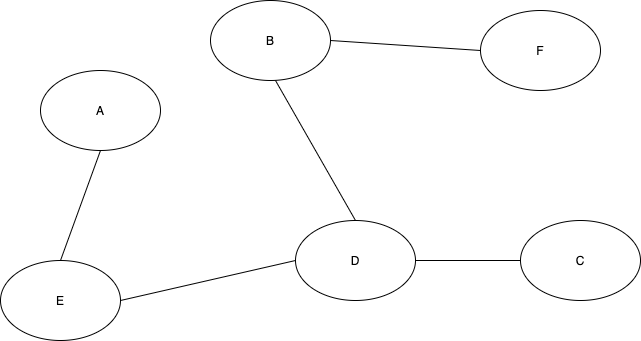
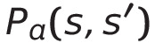
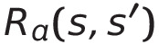
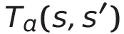
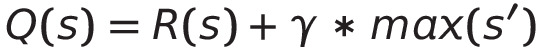

# Markov Decision Process (MDP) - The Bellman Equation Adapted to Reinforcement Learning

## Modelling a Problem with Words
Let's say you are an e-commerce business driver delivering a package in an area you do not know. You are the operator of a self-driving vehicle. You have a GPS system with a beautiful color map on it. The areas around you are represented by the letters A to F, as shown in the simplified map in the following diagram. You are presently at F. Your goal is to reach area C. You are happy, listening to the radio. Everything is going smoothly, and it looks like you are going to be there on time. The following graph represents the locations and routes that you can possibly cover.

## Modelling a Problem Mathematically
Our agent should be able to go from state 1 to state 2. This is guided by a strategy, which is represented as a policy, P. P is the policy made by an agent to go from state 1 to state 2 through an action, a. This can be represented by 

Where P is the policy, a is the action, s is state 1 and s' is state 2.

The reward will be represented in the same way

This means that R is the reward for the action, a, of going from s to s'. This also indicates the potential for all states to transition to another state. Generally, this reward is represented by a reward matrix where impossible paths are represented by a 0 or -1, possible paths are represented by some positive value, and our goal state is represented by the largest value (reward).

There are several properties of the decision making process.

> **The Markov property**: The process is applied when the past is not taken into account. This is the memoryless part of MDP, we always move forward toward the goal instead of looking back at historical data.

> **Unsupervised Learning**: Because this is a memoryless system, it is considered unsupervised learning. Supervised learning would mean that we have all the labels of the trip. We would know exactly what A means and use that property to make a decision. 

> **Stochastic Process**: The randomness of the decision making process for the next decision. The agent will metaphorically toss a coin thousands of times and measure the outcomes.

> **Reinforcement Learning**: Repeating a trial and error process with feedback from the agent's environment.

> **Markov Chain**: The process of going from state to state with no history in a random, stochastic way is called a **Markov Chain**.

So, we have 3 tools to do this. Our policy

 

Our reward

and our transition

T is the function that makes an agent decide to go from one state to another with a policy.

Bellman's Equation completes the MDP. Let's calculate the action-reward function for a transition, or the Q function

